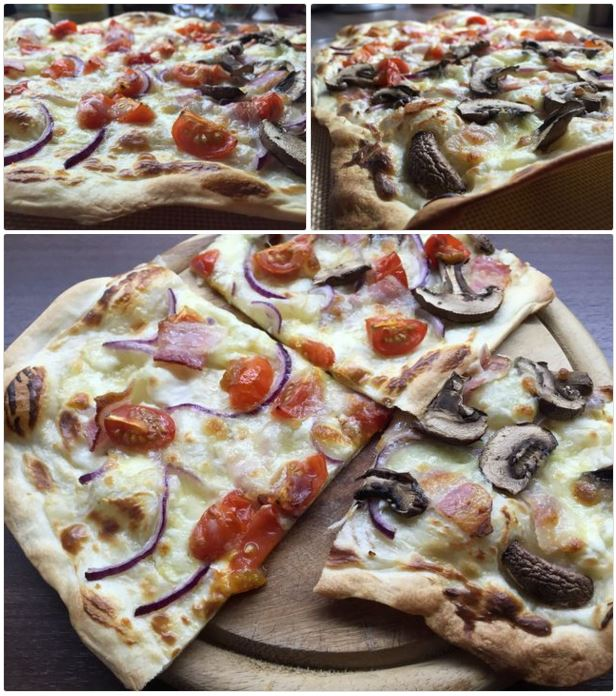
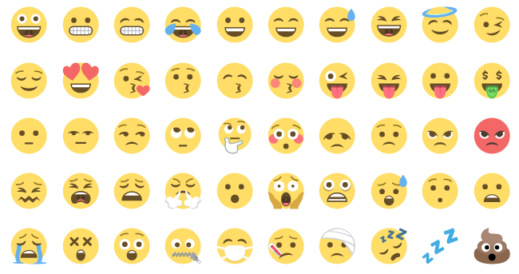

# Kartoffeldruck Cheats

This repository contains useful tips and tricks when using [Kartoffeldruck](https://github.com/nikku/kartoffeldruck) to generate a blog.

## Image Gallery

I use [Justified Gallery](miromannino.github.io/Justified-Gallery) to achieve gallery effects in blog posts. The gallery is loaded on browser side and (unfortunately; *depends: won't work with responsive designs*) not pre-rendered.



Install it using bower (`bower install --save justified-gallery`), setup grunt or gulp to copy necessary assets (css and js files) and reference those in your base template.

```
<head>
  ...
  <link rel="stylesheet" href="assets/vendor/justifiedGallery.min.css" type="text/css">
</head>
<body>
  ...
  <script src="assets/vendor/jquery.min.js"></script>

  <script src="assets/vendor/jquery.justifiedGallery.min.js"></script>
  <script>
    $('.image-gallery').justifiedGallery({
      rowHeight: 225 /* adjust depending on the content width and preferred layout */,
      lastRow: 'justify',
      margins: 3
    });
  </script>
</body>
```

The gallery gets applied on all elements with class `image-gallery`. In order to simplify gallery creation create a nunjucks macro at  `/templates/macro/image-gallery.html`:
```

  
    
  
  <figure id="image-gallery-{{ 'image-gallery-id' | sequence }}" class="image-gallery {{ className }}">
    
      
      
        
        
      
      <a href="{{ src | imageSize(1024) }}" title="{{ alt }}" data-gallery="{{ galleryId }}">
        
      </a>
    
  </figure>


```

In order to use `isObject` and `sequence` as filter those needs to be registered in your `kartoffeldruck.js`:
```
nunjucks.addFilter('isObject', require('lodash/lang/isObject'));
nunjucks.addFilter('sequence', require('./helpers/sequence'));
```

with `/helpers/sequence.js` being an unique ID generator
```
var sequence = {};

module.exports = function sequence(group)  {
  if (sequence[group] === undefined) {
    var val = sequence[group] = 0;
  } else {
    var val = sequence[group]++;
  }
  return val;
};
```

**Note**: A previous version of this file proposed another technique for ID generation, which resulted in duplicated IDs on pages with calls to `render` (e.g. paginated overview page).

This macro has some features not strictly necessary for justified gallery:
* You could omit the id on `<figure id="...">` and purge `groupId`.
* You could omit the rel on `<a rel="...">` and purge `galleryId`. This one is used to allow clicking a picture and opening a lightbox showing all pictures of a post or group.

Assuming your template file is stored under `/template` your can import this macro using ``.

There are several ways to use it in your posts:
```
# caption for first picture;
# use <name> as galleryId to show all pictures of a post in lightbox
{{
  image_gallery([
    {src: relative('assets/attachments/pic-1.jpg'), caption: 'My caption'},
    relative('assets/attachments/pic-2.jpg'),
    relative('assets/attachments/pic-3.jpg')
  ], name)
}}

# no captions;
# generate unique galleryId to show only pictures of this group in lightbox
{{
  image_gallery([
    relative('assets/attachments/pic-1.jpg'),
    relative('assets/attachments/pic-2.jpg'),
    relative('assets/attachments/pic-3.jpg')
  ])
}}
```

If you use lightbox (or [colorbox](http://miromannino.github.io/Justified-Gallery/lightboxes/), like me) you might want to add a `rel` the same `galleryId` when grouping by post is desired.

Also, justified gallery supports different image sizes (`sizeRangeSuffixes`) to speed up loading. This requires some setup on your asset pipeline and is therefore rather specific.

## Emoticons

There are many libraries/iconsets for emoticons in the field. First I implemented [twemoji](https://github.com/twitter/twemoji), but their visual appearance doesn't really fit into a blog with a rather modern design.

I'm now using the emoticons from [Emojione](http://emojione.com/). There's also a [gallery](http://emoji.codes).



In order to use it install it via `npm install --save-dev emojione` or [bower](https://github.com/Ranks/emojione) and setup your `Gruntfile.js` or `gulpfile.js` to copy necessary artifacts into your assets folder.

Next, we need [nunjucks-filter](https://github.com/SamyPesse/nunjucks-filter) (`npm install --save-dev nunjucks-filter`) until [this nunjucks bug is resolved](https://github.com/mozilla/nunjucks/issues/576).

Import it in the head of your `kartoffeldruck.js` as follows:
```
var NunjucksFilter = require('nunjucks-filter')(require('nunjucks'));
```

Then add it as extension to the nunjucks instance obtained from kartoffeldruck:
```
module.exports = function(druck) {
  ...
  var nunjucks = druck.getNunjucks();
  nunjucks.addExtension('FilterExtension', new NunjucksFilter(nunjucks));
  nunjucks.addFilter('emojify', require('./helpers/emojify'));
  ...
};
```

We also added our filter `/helpers/emojify`, which looks as simple as
```
var emojione = require('emojione');

emojione.ascii = true;
emojione.unicodeAlt = true;
emojione.imageType = 'svg';

module.exports = function emojify(str)  {
  return emojione.toImage(str);
};
```

This setup uses the CDNed SVG emoticons and allows ASCII codes such as `:)`. If you rather serve them yourself refer to the manual from Emojione - there are various formats available.

As a last step we need to apply the filter to a portion in our template. You can either simply use `'some text with :blush:' | emojify'` or use the block syntax provided by the extension:
```

  ... content here ...

```

Enjoy :smile:
